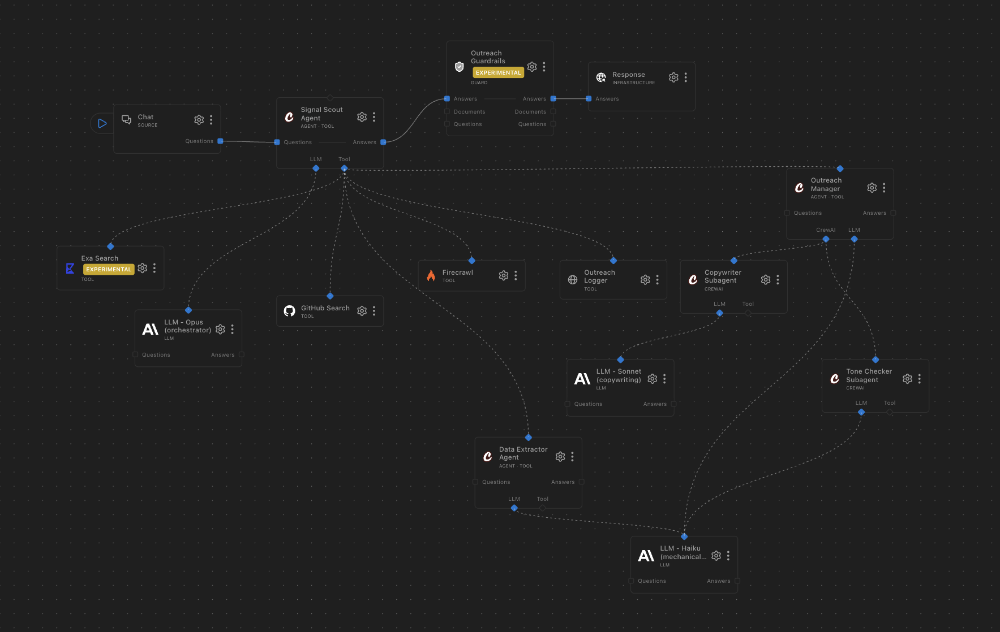
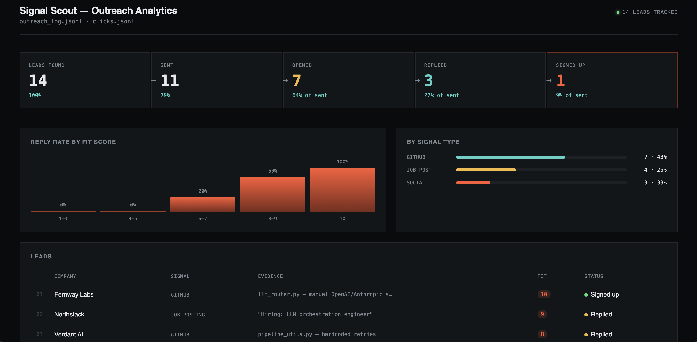

# Signal Scout — RocketRide Lead-Gen Pipeline

A RocketRide pipeline that finds companies building custom LLM pipeline infrastructure by hand (GitHub, job postings, social posts), qualifies them, and drafts personalized, developer-to-developer outreach — with A/B copy variants, click tracking, and a local dashboard. Every message is a **draft only**; nothing is ever sent, posted, or published automatically.

## Pipeline



Solid connections are the request/response data flow (Chat → Signal Scout Agent → Outreach Guardrails → Response); dashed connections are control-plane wiring — the tools and sub-agents each agent invokes, and the LLM each one reasons with. Open `sales.pipe` in the RocketRide canvas to explore it live.

### How it works

1. **Signal Scout Agent** (Claude Opus 4.8) is the only node wired to Chat. It searches GitHub, Exa, and scrapes candidate pages via Firecrawl for signs of hand-rolled, multi-provider LLM orchestration.
2. It delegates structuring to the **Data Extractor Agent**, which scores each lead 0–10 across five weighted categories (evidence directness, multi-provider complexity, recency, corroboration, organizational signal) and assigns a random **A/B variant**.
3. For leads scoring 6+, it delegates to the **Outreach Manager**, which runs a two-stage CrewAI crew: **Copywriter Subagent** (Claude Sonnet 5) drafts the message, **Tone Checker Subagent** (Claude Haiku 4.5) reviews it against a strict style spec (word count, banned openers, no em dashes, variant-conditional AI-disclosure line, exact RocketRide description).
4. Each finalized lead is logged via the **Outreach Logger** tool to `outreach_log.jsonl` (through the local tracker server — see below).
5. The finished draft passes through **Outreach Guardrails** (PII, prompt-injection, hallucination, and spam-phrase checks, policy mode `block`) before reaching you in Chat.

Multi-step agent chaining in RocketRide only works via control-plane delegation (tools / sub-agents), not by piping one agent's answer into another data-lane node — that's why every step past the Signal Scout Agent is wired as a tool it invokes, rather than a linear chain of boxes.

### Model routing

| Node | Model | Why |
|---|---|---|
| Signal Scout Agent | Opus 4.8 | Judges ambiguous evidence, picks tools, decides fit |
| Copywriter Subagent | Sonnet 5 | Needs real writing quality — this is the message a human sends |
| Data Extractor, Outreach Manager, Tone Checker | Haiku 4.5 | Mechanical: schema extraction, fixed-order delegation, checklist-style review |

## Setup

1. Install the RocketRide VS Code extension and open this folder as a workspace.
2. Fill in `.env` (see `env.example` for the full list) with:
   - `ROCKETRIDE_ANTHROPIC_KEY` — Claude API key
   - `ROCKETRIDE_EXA_API_KEY` — [exa.ai](https://exa.ai)
   - `ROCKETRIDE_FIRECRAWL_API_KEY` — [firecrawl.dev](https://firecrawl.dev)
   - `ROCKETRIDE_GITHUB_TOKEN` — classic PAT, no scopes needed (or `public_repo` if a call ever 403s)
3. Start the tracker server (below) before running the pipeline — the Outreach Logger tool calls it after every finalized lead.
4. Open `sales.pipe` in the RocketRide canvas → Chat tab → ask it to find leads, e.g.:
   > Find companies that are building custom LLM pipeline infrastructure by hand. Give me a shortlist of qualified leads (fit score 6+) with drafted outreach messages for each.

## Tracker server

```
cd tracker
npm install
npm start          # listens on http://localhost:3000
```

- `GET /r/:leadId` — logs the click to `tracker/clicks.jsonl` and redirects to the RocketRide site, tagging the URL with `utm_content` (company) and `utm_term` (A/B variant) looked up from `outreach_log.jsonl`.
- `POST /log` — called by the pipeline to append each finalized lead to `outreach_log.jsonl`.

**Before sending anything for real**, expose the server publicly and swap the URL in the lead's `tracking_url`:

```
npx ngrok http 3000
```

### Updating a lead's status

As you manually send messages and hear back:

```
node update.js <lead_id> --sent true
node update.js <lead_id> --replied true
node update.js <lead_id> --signed_up true
```

## Dashboard



```
python3 -m http.server 8080   # from the repo root
```

Open `http://localhost:8080/dashboard/`. Reads `outreach_log.jsonl` and `tracker/clicks.jsonl` directly (no build step) and shows:

- **Funnel** — found → sent → opened → replied → signed up, with conversion % at each step
- **Variant performance** — A vs. B: sent, click rate, reply rate, signup rate
- **Reply rate by fit-score bucket** (1–3, 4–5, 6–7, 8–9, 10)
- **By signal type** — lead count and reply rate for GitHub / job posting / social
- **Leads table** — company, signal, evidence, fit score, variant, current status

## Project structure

```
sales.pipe              RocketRide pipeline definition
tracker/
  server.js             click tracking + lead logging (Express)
  update.js             CLI to mark a lead as sent/replied/signed_up
  clicks.jsonl           (gitignored — generated)
dashboard/
  index.html             single-file dashboard, no build step
outreach_log.jsonl       (gitignored — generated, one line per lead)
env.example              template for .env
```

## Safety

Nothing in this pipeline sends, posts, or publishes anything on its own. Every draft returned in Chat is meant to be manually copy/pasted (or reviewed and sent) by a human. The tracker server only redirects and logs; it never initiates outreach.
